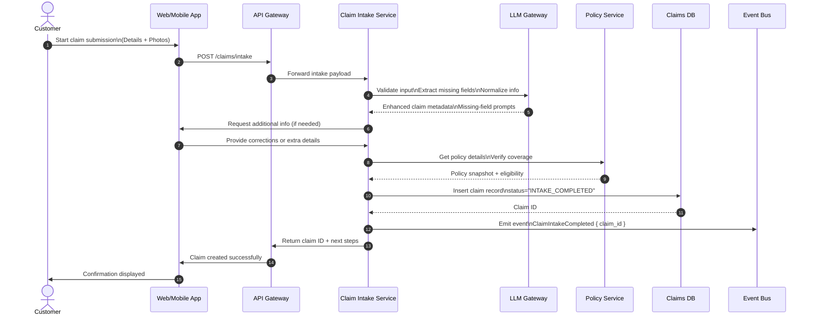

```mermaid
sequenceDiagram
    autonumber

    actor Customer
    participant UI as Web/Mobile App
    participant API as API Gateway
    participant Intake as Claim Intake Service
    participant LLM as LLM Gateway
    participant Policy as Policy Service
    participant DB as Claims DB
    participant Bus as Event Bus

    %% --- STEP 1: Customer Starts Claim ---
    Customer ->> UI: Start claim submission\n(Details + Photos)
    UI ->> API: POST /claims/intake

    %% --- STEP 2: Routing to Intake Service ---
    API ->> Intake: Forward intake payload

    %% --- STEP 3: LLM Smart Intake Validation ---
    Intake ->> LLM: Validate input\nExtract missing fields\nNormalize info
    LLM -->> Intake: Enhanced claim metadata\nMissing-field prompts

    %% --- STEP 4: Missing Info Resolution ---
    Intake ->> UI: Request additional info (if needed)
    UI ->> Intake: Provide corrections or extra details

    %% --- STEP 5: Policy Eligibility Check ---
    Intake ->> Policy: Get policy details\nVerify coverage
    Policy -->> Intake: Policy snapshot + eligibility

    %% --- STEP 6: Create Initial Claim Record ---
    Intake ->> DB: Insert claim record\nstatus="INTAKE_COMPLETED"
    DB -->> Intake: Claim ID

    %% --- STEP 7: Publish Event ---
    Intake ->> Bus: Emit event\nClaimIntakeCompleted { claim_id }

    %% --- STEP 8: Respond to User ---
    Intake ->> API: Return claim ID + next steps
    API ->> UI: Claim created successfully
    UI ->> Customer: Confirmation displayed
```