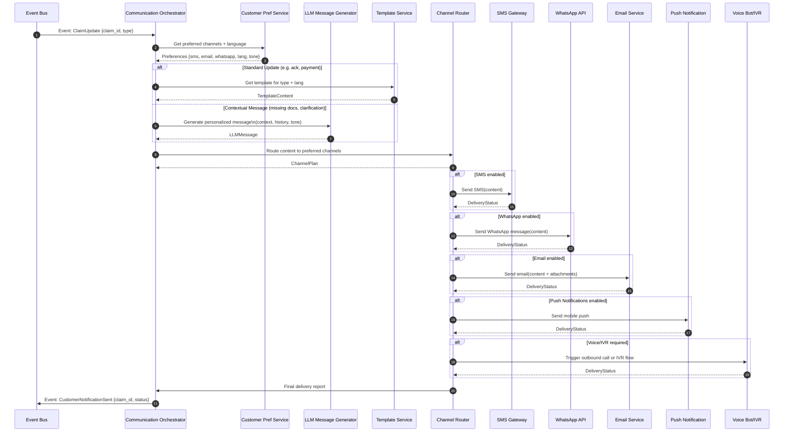

```mermaid
sequenceDiagram
    autonumber

    participant Bus as Event Bus
    participant CommSvc as Communication Orchestrator
    participant Pref as Customer Pref Service
    participant LLM as LLM Message Generator
    participant Temp as Template Service
    participant Channel as Channel Router
    participant SMS as SMS Gateway
    participant WA as WhatsApp API
    participant Email as Email Service
    participant Push as Push Notification
    participant IVR as Voice Bot/IVR

    %% 1. Trigger
    Bus ->> CommSvc: Event: ClaimUpdate {claim_id, type}

    %% 2. Fetch customer channel preferences
    CommSvc ->> Pref: Get preferred channels + language
    Pref -->> CommSvc: Preferences {sms, email, whatsapp, lang, tone}

    %% 3. Fetch template or generate from LLM
    alt Standard Update (e.g. ack, payment)
        CommSvc ->> Temp: Get template for type + lang
        Temp -->> CommSvc: TemplateContent
    else Contextual Message (missing docs, clarification)
        CommSvc ->> LLM: Generate personalized message\n(context, history, tone)
        LLM -->> CommSvc: LLMMessage
    end

    %% 4. Channel routing
    CommSvc ->> Channel: Route content to preferred channels
    Channel -->> CommSvc: ChannelPlan

    %% 5. Multi-channel delivery
    alt SMS enabled
        Channel ->> SMS: Send SMS(content)
        SMS -->> Channel: DeliveryStatus
    end

    alt WhatsApp enabled
        Channel ->> WA: Send WhatsApp message(content)
        WA -->> Channel: DeliveryStatus
    end

    alt Email enabled
        Channel ->> Email: Send email(content + attachments)
        Email -->> Channel: DeliveryStatus
    end

    alt Push Notifications enabled
        Channel ->> Push: Send mobile push
        Push -->> Channel: DeliveryStatus
    end

    alt Voice/IVR required
        Channel ->> IVR: Trigger outbound call or IVR flow
        IVR -->> Channel: DeliveryStatus
    end

    %% 6. Orchestrator enriches final state
    Channel ->> CommSvc: Final delivery report

    %% 7. Event back to bus
    CommSvc ->> Bus: Event: CustomerNotificationSent {claim_id, status}
```