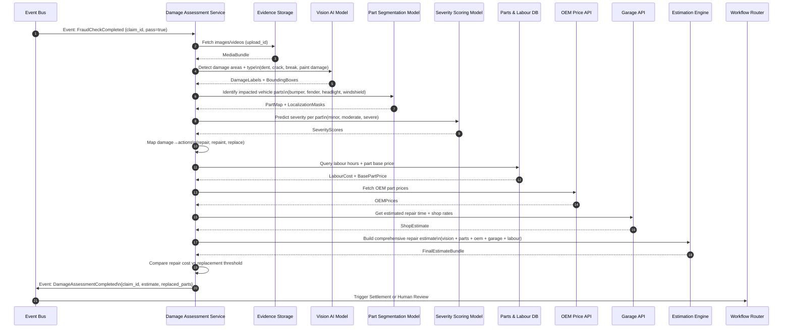

```mermaid
sequenceDiagram
    autonumber

    participant Bus as Event Bus
    participant DmgSvc as Damage Assessment Service
    participant Store as Evidence Storage
    participant Vision as Vision AI Model
    participant PartSeg as Part Segmentation Model
    participant Sev as Severity Scoring Model
    participant PriceDB as Parts & Labour DB
    participant OEM as OEM Price API
    participant Garage as Garage API
    participant Est as Estimation Engine
    participant Next as Workflow Router

    %% STEP 1: Trigger
    Bus ->> DmgSvc: Event: FraudCheckCompleted {claim_id, pass=true}

    %% STEP 2: Load Images/Videos/Documents
    DmgSvc ->> Store: Fetch images/videos (upload_id)
    Store -->> DmgSvc: MediaBundle

    %% STEP 3: Vision Classification
    DmgSvc ->> Vision: Detect damage areas + type\n(dent, crack, break, paint damage)
    Vision -->> DmgSvc: DamageLabels + BoundingBoxes

    %% STEP 4: Part Segmentation
    DmgSvc ->> PartSeg: Identify impacted vehicle parts\n(bumper, fender, headlight, windshield)
    PartSeg -->> DmgSvc: PartMap + LocalizationMasks

    %% STEP 5: Severity Model
    DmgSvc ->> Sev: Predict severity per part\n(minor, moderate, severe)
    Sev -->> DmgSvc: SeverityScores

    %% STEP 6: Required Parts & Actions
    DmgSvc ->> DmgSvc: Map damage→actions\n(repair, repaint, replace)

    %% STEP 7: Cost Lookup (Internal DB)
    DmgSvc ->> PriceDB: Query labour hours + part base price
    PriceDB -->> DmgSvc: LabourCost + BasePartPrice

    %% STEP 8: OEM or Market Pricing
    DmgSvc ->> OEM: Fetch OEM part prices
    OEM -->> DmgSvc: OEMPrices

    %% STEP 9: Garage Integration (Optional)
    DmgSvc ->> Garage: Get estimated repair time + shop rates
    Garage -->> DmgSvc: ShopEstimate

    %% STEP 10: Estimate Engine Fusion
    DmgSvc ->> Est: Build comprehensive repair estimate\n(vision + parts + oem + garage + labour)
    Est -->> DmgSvc: FinalEstimateBundle

    %% STEP 11: Decision: Repair vs Replace
    DmgSvc ->> DmgSvc: Compare repair cost vs replacement threshold

    %% STEP 12: Output next-stage signal
    DmgSvc ->> Bus: Event: DamageAssessmentCompleted\n{claim_id, estimate, replaced_parts}

    %% STEP 13: Workflow Routing
    Bus ->> Next: Trigger Settlement or Human Review
```