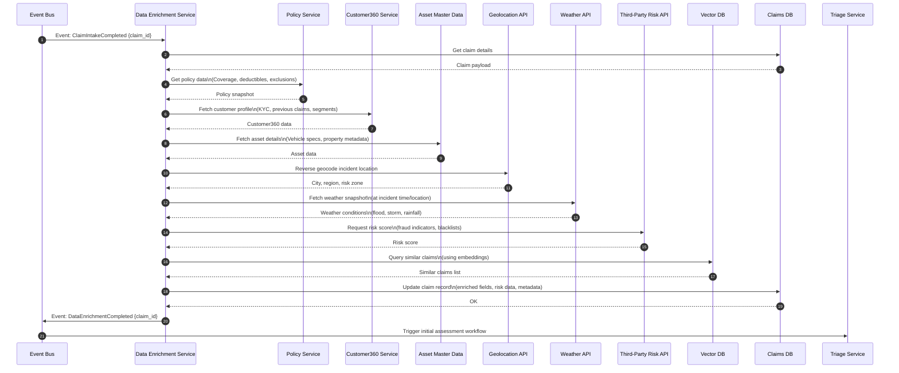

```mermaid
sequenceDiagram
    autonumber

    participant Bus as Event Bus
    participant Enrich as Data Enrichment Service
    participant Policy as Policy Service
    participant CRM as Customer360 Service
    participant Master as Asset Master Data
    participant Geo as Geolocation API
    participant Weather as Weather API
    participant RiskAPI as Third-Party Risk API
    participant VectorDB as Vector DB
    participant DB as Claims DB
    participant Triage as Triage Service

    %% --- STEP 1: Trigger from previous workflow ---
    Bus ->> Enrich: Event: ClaimIntakeCompleted {claim_id}

    %% --- STEP 2: Fetch Claim Snapshot ---
    Enrich ->> DB: Get claim details
    DB -->> Enrich: Claim payload

    %% --- STEP 3: Policy Lookup ---
    Enrich ->> Policy: Get policy data\n(Coverage, deductibles, exclusions)
    Policy -->> Enrich: Policy snapshot

    %% --- STEP 4: Customer 360 Enrichment ---
    Enrich ->> CRM: Fetch customer profile\n(KYC, previous claims, segments)
    CRM -->> Enrich: Customer360 data

    %% --- STEP 5: Asset (Vehicle/Property) Master Data ---
    Enrich ->> Master: Fetch asset details\n(Vehicle specs, property metadata)
    Master -->> Enrich: Asset data

    %% --- STEP 6: Geolocation Enrichment ---
    Enrich ->> Geo: Reverse geocode incident location
    Geo -->> Enrich: City, region, risk zone

    %% --- STEP 7: Weather Enrichment ---
    Enrich ->> Weather: Fetch weather snapshot\n(at incident time/location)
    Weather -->> Enrich: Weather conditions\n(flood, storm, rainfall)

    %% --- STEP 8: Third-Party Risk Checks ---
    Enrich ->> RiskAPI: Request risk score\n(fraud indicators, blacklists)
    RiskAPI -->> Enrich: Risk score

    %% --- STEP 9: Historical Similarity Search (Vector DB) ---
    Enrich ->> VectorDB: Query similar claims\n(using embeddings)
    VectorDB -->> Enrich: Similar claims list

    %% --- STEP 10: Save Enriched Metadata ---
    Enrich ->> DB: Update claim record\n(enriched fields, risk data, metadata)
    DB -->> Enrich: OK

    %% --- STEP 11: Emit Completion Event ---
    Enrich ->> Bus: Event: DataEnrichmentCompleted {claim_id}

    %% --- STEP 12: Notify Next Stage ---
    Bus ->> Triage: Trigger initial assessment workflow
```