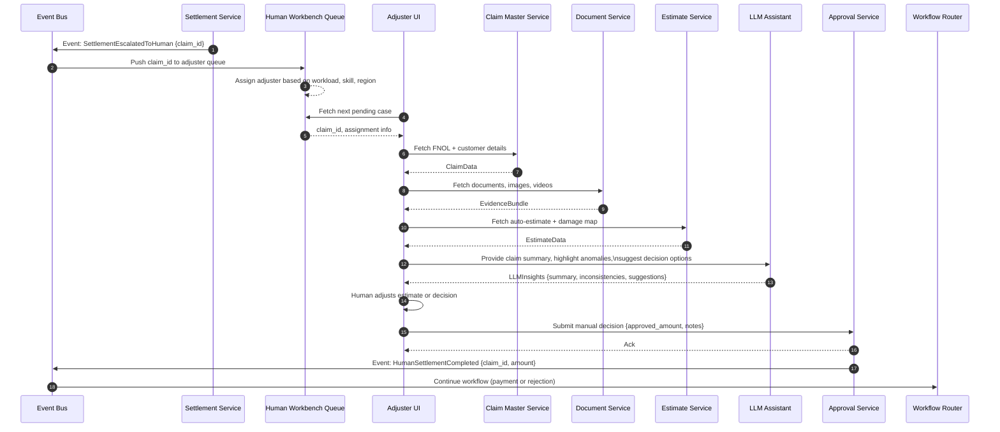

```mermaid
sequenceDiagram
    autonumber

    participant Bus as Event Bus
    participant SettleSvc as Settlement Service
    participant WorkQ as Human Workbench Queue
    participant UI as Adjuster UI
    participant ClaimSvc as Claim Master Service
    participant DocSvc as Document Service
    participant EstSvc as Estimate Service
    participant LLM as LLM Assistant
    participant Approve as Approval Service
    participant Next as Workflow Router

    %% STEP 1: Escalation Trigger
    SettleSvc ->> Bus: Event: SettlementEscalatedToHuman {claim_id}

    %% STEP 2: Queue Routing
    Bus ->> WorkQ: Push claim_id to adjuster queue
    WorkQ -->> WorkQ: Assign adjuster based on workload, skill, region

    %% STEP 3: Adjuster Opens Case
    UI ->> WorkQ: Fetch next pending case
    WorkQ -->> UI: claim_id, assignment info

    %% STEP 4: Load all claim data
    UI ->> ClaimSvc: Fetch FNOL + customer details
    ClaimSvc -->> UI: ClaimData

    UI ->> DocSvc: Fetch documents, images, videos
    DocSvc -->> UI: EvidenceBundle

    UI ->> EstSvc: Fetch auto-estimate + damage map
    EstSvc -->> UI: EstimateData

    %% STEP 5: LLM Assistance (Summaries + Recommendations)
    UI ->> LLM: Provide claim summary, highlight anomalies,\nsuggest decision options
    LLM -->> UI: LLMInsights {summary, inconsistencies, suggestions}

    %% STEP 6: Adjuster Reviews & Decides
    UI ->> UI: Human adjusts estimate or decision

    %% STEP 7: Submit Final Decision
    UI ->> Approve: Submit manual decision {approved_amount, notes}
    Approve -->> UI: Ack

    %% STEP 8: Publish final outcome
    Approve ->> Bus: Event: HumanSettlementCompleted {claim_id, amount}
    Bus ->> Next: Continue workflow (payment or rejection)
```