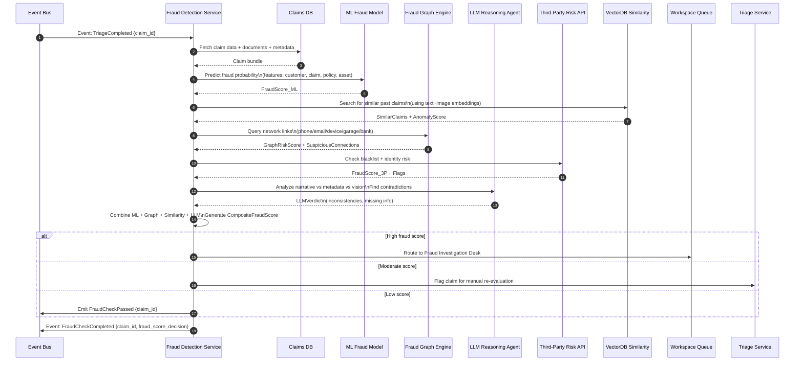

```mermaid
sequenceDiagram
    autonumber

    participant Bus as Event Bus
    participant FraudSvc as Fraud Detection Service
    participant DB as Claims DB
    participant ML as ML Fraud Model
    participant Graph as Fraud Graph Engine
    participant LLM as LLM Reasoning Agent
    participant RiskAPI as Third-Party Risk API
    participant Sim as VectorDB Similarity
    participant Queue as Workspace Queue
    participant Triage as Triage Service

    %% --- STEP 1: Trigger from previous workflow ---
    Bus ->> FraudSvc: Event: TriageCompleted {claim_id}

    %% --- STEP 2: Load enriched claim snapshot ---
    FraudSvc ->> DB: Fetch claim data + documents + metadata
    DB -->> FraudSvc: Claim bundle

    %% --- STEP 3: ML Fraud Probability ---
    FraudSvc ->> ML: Predict fraud probability\n(features: customer, claim, policy, asset)
    ML -->> FraudSvc: FraudScore_ML

    %% --- STEP 4: Historical Similarity Lookup ---
    FraudSvc ->> Sim: Search for similar past claims\n(using text+image embeddings)
    Sim -->> FraudSvc: SimilarClaims + AnomalyScore

    %% --- STEP 5: Graph Network Analysis ---
    FraudSvc ->> Graph: Query network links\n(phone/email/device/garage/bank)
    Graph -->> FraudSvc: GraphRiskScore + SuspiciousConnections

    %% --- STEP 6: External Risk APIs ---
    FraudSvc ->> RiskAPI: Check blacklist + identity risk
    RiskAPI -->> FraudSvc: FraudScore_3P + Flags

    %% --- STEP 7: LLM Narrative Reasoning ---
    FraudSvc ->> LLM: Analyze narrative vs metadata vs vision\nFind contradictions
    LLM -->> FraudSvc: LLMVerdict\n(inconsistencies, missing info)

    %% --- STEP 8: Fraud Aggregation Layer ---
    FraudSvc ->> FraudSvc: Combine ML + Graph + Similarity + LLM\nGenerate CompositeFraudScore

    %% --- STEP 9: Final Decision Logic ---
    alt High fraud score
        FraudSvc ->> Queue: Route to Fraud Investigation Desk
    else Moderate score
        FraudSvc ->> Triage: Flag claim for manual re-evaluation
    else Low score
        FraudSvc ->> Bus: Emit FraudCheckPassed {claim_id}
    end

    %% --- STEP 10: Emit Result Event ---
    FraudSvc ->> Bus: Event: FraudCheckCompleted {claim_id, fraud_score, decision}
```