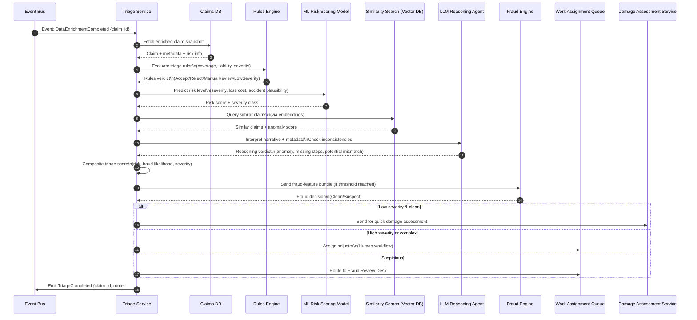

```mermaid
sequenceDiagram
    autonumber

    participant Bus as Event Bus
    participant Triage as Triage Service
    participant DB as Claims DB
    participant Rules as Rules Engine
    participant ML as ML Risk Scoring Model
    participant Sim as Similarity Search (Vector DB)
    participant LLM as LLM Reasoning Agent
    participant Fraud as Fraud Engine
    participant Queue as Work Assignment Queue
    participant Assessment as Damage Assessment Service

    %% --- STEP 1: Trigger from Enrichment ---
    Bus ->> Triage: Event: DataEnrichmentCompleted {claim_id}

    %% --- STEP 2: Load all enriched metadata ---
    Triage ->> DB: Fetch enriched claim snapshot
    DB -->> Triage: Claim + metadata + risk info

    %% --- STEP 3: Rules Engine Evaluation ---
    Triage ->> Rules: Evaluate triage rules\n(coverage, liability, severity)
    Rules -->> Triage: Rules verdict\n(Accept/Reject/ManualReview/LowSeverity)

    %% --- STEP 4: ML Risk Scoring ---
    Triage ->> ML: Predict risk level\n(severity, loss cost, accident plausibility)
    ML -->> Triage: Risk score + severity class

    %% --- STEP 5: Historical Similarity Check ---
    Triage ->> Sim: Query similar claims\n(via embeddings)
    Sim -->> Triage: Similar claims + anomaly score

    %% --- STEP 6: LLM Reasoning Layer (Edge-case logic) ---
    Triage ->> LLM: Interpret narrative + metadata\nCheck inconsistencies
    LLM -->> Triage: Reasoning verdict\n(anomaly, missing steps, potential mismatch)

    %% --- STEP 7: Combine ML + Rules + LLM + Similarity ---
    Triage ->> Triage: Composite triage score\n(risk, fraud likelihood, severity)

    %% --- STEP 8: Check if case should go to fraud ---
    Triage ->> Fraud: Send fraud-feature bundle (if threshold reached)
    Fraud -->> Triage: Fraud decision\n(Clean/Suspect)

    %% --- STEP 9: Final Routing Decision ---
    alt Low severity & clean
        Triage ->> Assessment: Send for quick damage assessment
    else High severity or complex
        Triage ->> Queue: Assign adjuster\n(Human workflow)
    else Suspicious
        Triage ->> Queue: Route to Fraud Review Desk
    end

    %% --- STEP 10: Publish Event ---
    Triage ->> Bus: Emit TriageCompleted {claim_id, route}
```