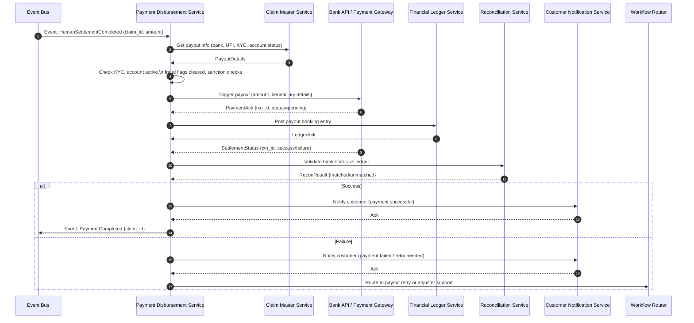

```mermaid
sequenceDiagram
    autonumber

    participant Bus as Event Bus
    participant PaySvc as Payment Disbursement Service
    participant ClaimSvc as Claim Master Service
    participant Bank as Bank API / Payment Gateway
    participant Ledger as Financial Ledger Service
    participant Recon as Reconciliation Service
    participant Cust as Customer Notification Service
    participant Next as Workflow Router

    %% STEP 1: Trigger on approval
    Bus ->> PaySvc: Event: HumanSettlementCompleted {claim_id, amount}

    %% STEP 2: Fetch customer payout details
    PaySvc ->> ClaimSvc: Get payout info (bank, UPI, KYC, account status)
    ClaimSvc -->> PaySvc: PayoutDetails

    %% STEP 3: Validate eligibility for payment
    PaySvc ->> PaySvc: Check KYC, account active,\n fraud flags cleared, sanction checks

    %% STEP 4: Initiate payment to bank / gateway
    PaySvc ->> Bank: Trigger payout {amount, beneficiary details}
    Bank -->> PaySvc: PaymentAck {txn_id, status=pending}

    %% STEP 5: Record request in ledger
    PaySvc ->> Ledger: Post payout booking entry
    Ledger -->> PaySvc: LedgerAck

    %% STEP 6: Bank completes actual transfer
    Bank -->> PaySvc: SettlementStatus {txn_id, success/failure}

    %% STEP 7: Reconciliation
    PaySvc ->> Recon: Validate bank status vs ledger
    Recon -->> PaySvc: ReconResult {matched/unmatched}

    %% STEP 8: Result-based actions
    alt Success
        PaySvc ->> Cust: Notify customer (payment successful)
        Cust -->> PaySvc: Ack
        PaySvc ->> Bus: Event: PaymentCompleted {claim_id}
    else Failure
        PaySvc ->> Cust: Notify customer (payment failed / retry needed)
        Cust -->> PaySvc: Ack
        PaySvc ->> Next: Route to payout retry or adjuster support
    end
```