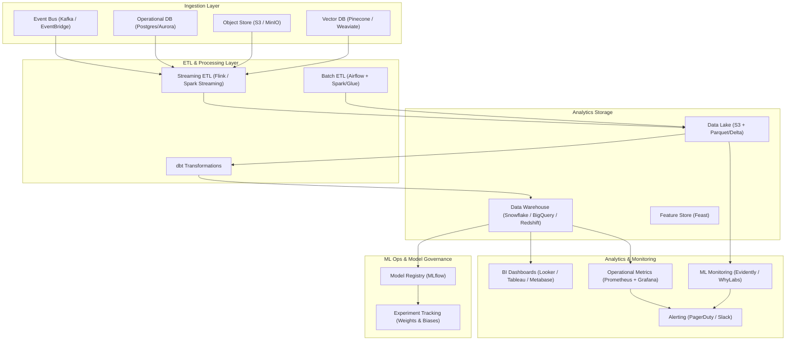

```mermaid
flowchart TB
    %% ---------- INGESTION LAYER ----------
    subgraph INGESTION["Ingestion Layer"]
        A1["Event Bus (Kafka / EventBridge)"]
        A2["Operational DB (Postgres/Aurora)"]
        A3["Object Store (S3 / MinIO)"]
        A4["Vector DB (Pinecone / Weaviate)"]
    end

    %% ---------- ETL / PROCESSING ----------
    subgraph PROCESSING["ETL & Processing Layer"]
        B1["Streaming ETL (Flink / Spark Streaming)"]
        B2["Batch ETL (Airflow + Spark/Glue)"]
        B3["dbt Transformations"]
    end

    %% ---------- STORAGE LAYER ----------
    subgraph STORAGE["Analytics Storage"]
        C1["Data Lake (S3 + Parquet/Delta)"]
        C2["Data Warehouse (Snowflake / BigQuery / Redshift)"]
        C3["Feature Store (Feast)"]
    end

    %% ---------- SERVING / ANALYTICS ----------
    subgraph SERVING["Analytics & Monitoring"]
        D1["BI Dashboards (Looker / Tableau / Metabase)"]
        D2["Operational Metrics (Prometheus + Grafana)"]
        D3["ML Monitoring (Evidently / WhyLabs)"]
        D4["Alerting (PagerDuty / Slack)"]
    end

    %% ---------- ML OPS LAYER ----------
    subgraph MLOPS["ML Ops & Model Governance"]
        M1["Model Registry (MLflow)"]
        M2["Experiment Tracking (Weights & Biases)"]
    end

    %% ---------- DATA FLOW ----------
    A1 --> B1
    A2 --> B1
    A3 --> B1
    A4 --> B1

    B1 --> C1
    B2 --> C1

    C1 --> B3
    B3 --> C2

    C2 --> D1
    C2 --> D2
    C2 --> M1

    C1 --> D3

    D2 --> D4
    D3 --> D4

    M1 --> M2
```