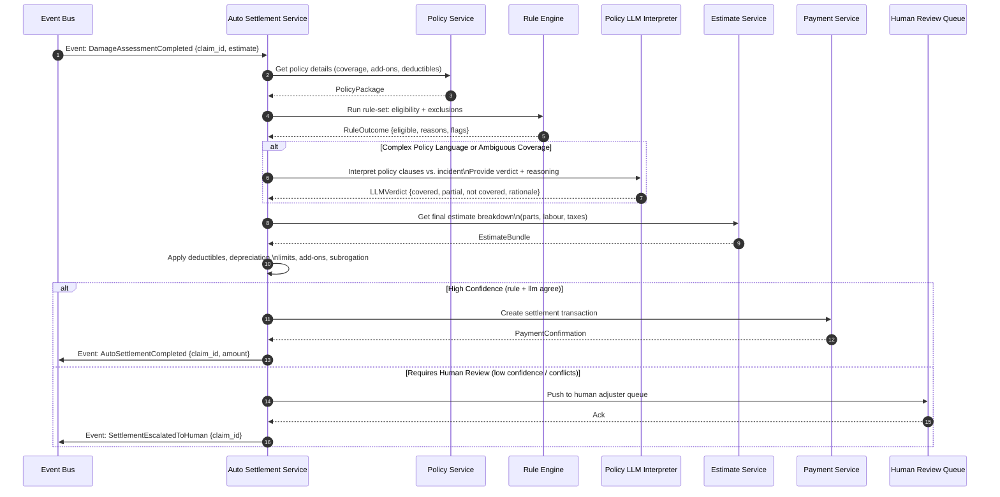

```mermaid
sequenceDiagram
    autonumber

    participant Bus as Event Bus
    participant SettleSvc as Auto Settlement Service
    participant PolicySvc as Policy Service
    participant RuleEng as Rule Engine
    participant LLM as Policy LLM Interpreter
    participant Price as Estimate Service
    participant Pay as Payment Service
    participant WorkQ as Human Review Queue

    %% STEP 1: Trigger
    Bus ->> SettleSvc: Event: DamageAssessmentCompleted {claim_id, estimate}

    %% STEP 2: Fetch Policy Data
    SettleSvc ->> PolicySvc: Get policy details (coverage, add-ons, deductibles)
    PolicySvc -->> SettleSvc: PolicyPackage

    %% STEP 3: Run Deterministic Rules
    SettleSvc ->> RuleEng: Run rule-set: eligibility + exclusions
    RuleEng -->> SettleSvc: RuleOutcome {eligible, reasons, flags}

    %% STEP 4: If rule flags unclear → LLM Interpretation
    alt Complex Policy Language or Ambiguous Coverage
        SettleSvc ->> LLM: Interpret policy clauses vs. incident\nProvide verdict + reasoning
        LLM -->> SettleSvc: LLMVerdict {covered, partial, not covered, rationale}
    end

    %% STEP 5: Cost & Coverage Reconciliation
    SettleSvc ->> Price: Get final estimate breakdown\n(parts, labour, taxes)
    Price -->> SettleSvc: EstimateBundle

    %% STEP 6: Compute settlement amount
    SettleSvc ->> SettleSvc: Apply deductibles, depreciation,\nlimits, add-ons, subrogation

    %% STEP 7: Decision
    alt High Confidence (rule + llm agree)
        SettleSvc ->> Pay: Create settlement transaction
        Pay -->> SettleSvc: PaymentConfirmation
        SettleSvc ->> Bus: Event: AutoSettlementCompleted {claim_id, amount}
    else Requires Human Review (low confidence / conflicts)
        SettleSvc ->> WorkQ: Push to human adjuster queue
        WorkQ -->> SettleSvc: Ack
        SettleSvc ->> Bus: Event: SettlementEscalatedToHuman {claim_id}
    end
```