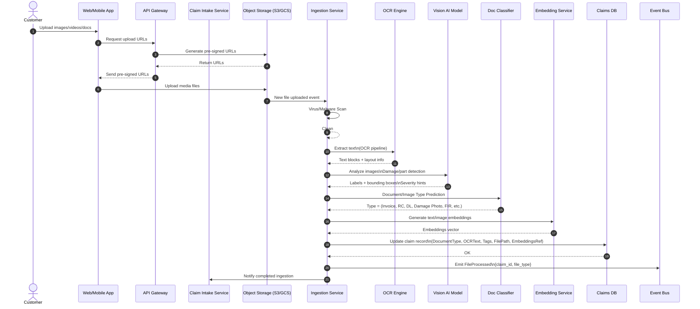

```mermaid
sequenceDiagram
    autonumber

    actor Customer
    participant UI as Web/Mobile App
    participant API as API Gateway
    participant Intake as Claim Intake Service
    participant Storage as Object Storage (S3/GCS)
    participant Ingest as Ingestion Service
    participant OCR as OCR Engine
    participant Vision as Vision AI Model
    participant Classifier as Doc Classifier
    participant Emb as Embedding Service
    participant DB as Claims DB
    participant Bus as Event Bus

    %% --- STEP 1: Customer Uploads Files ---
    Customer ->> UI: Upload images/videos/docs
    UI ->> API: Request upload URLs
    API ->> Storage: Generate pre-signed URLs
    Storage -->> API: Return URLs
    API -->> UI: Send pre-signed URLs
    UI ->> Storage: Upload media files

    %% --- STEP 2: Storage Triggers Ingestion ---
    Storage ->> Ingest: New file uploaded event

    %% --- STEP 3: Virus Scan (Optional) ---
    Ingest ->> Ingest: Virus/Malware Scan
    Ingest -->> Ingest: Clean

    %% --- STEP 4: OCR (For Documents/Images) ---
    Ingest ->> OCR: Extract text\n(OCR pipeline)
    OCR -->> Ingest: Text blocks + layout info

    %% --- STEP 5: Vision AI (For Damage Images) ---
    Ingest ->> Vision: Analyze images\nDamage/part detection
    Vision -->> Ingest: Labels + bounding boxes\nSeverity hints

    %% --- STEP 6: Classification ---
    Ingest ->> Classifier: Document/Image Type Prediction
    Classifier -->> Ingest: Type = (Invoice, RC, DL, Damage Photo, FIR, etc.)

    %% --- STEP 7: Embeddings for RAG ---
    Ingest ->> Emb: Generate text/image embeddings
    Emb -->> Ingest: Embeddings vector

    %% --- STEP 8: Save Metadata ---
    Ingest ->> DB: Update claim record\n(DocumentType, OCRText, Tags, FilePath, EmbeddingsRef)
    DB -->> Ingest: OK

    %% --- STEP 9: Trigger Downstream Processing ---
    Ingest ->> Bus: Emit FileProcessed\n{claim_id, file_type}

    %% --- STEP 10: Notify Intake (Optional) ---
    Ingest ->> Intake: Notify completed ingestion
```