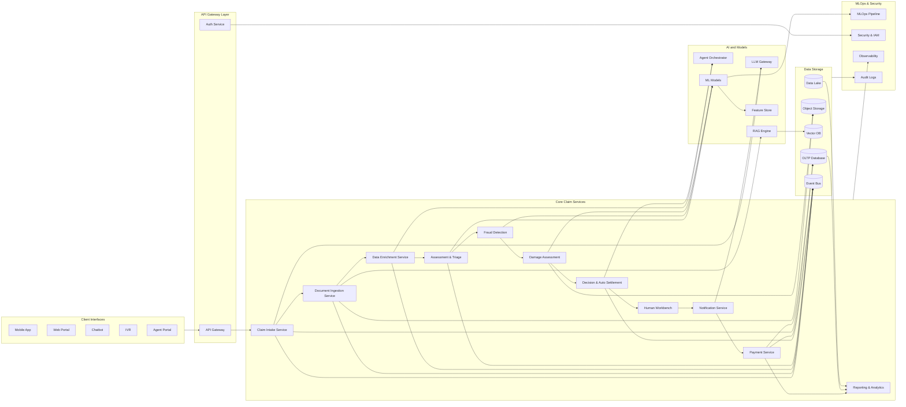

```mermaid
flowchart LR

%% =======================
%% CLIENT LAYER
%% =======================
subgraph CLIENT["Client Interfaces"]
    A1[Mobile App]
    A2[Web Portal]
    A3[Chatbot]
    A4[IVR]
    A5[Agent Portal]
end

%% =======================
%% API GATEWAY
%% =======================
subgraph GATEWAY["API Gateway Layer"]
    B1[API Gateway]
    B2[Auth Service]
end

CLIENT --> B1

%% =======================
%% CORE SERVICES
%% =======================
subgraph CORE["Core Claim Services"]
    C1[Claim Intake Service]
    C2[Document Ingestion Service]
    C3[Data Enrichment Service]
    C4[Assessment & Triage]
    C5[Fraud Detection]
    C6[Damage Assessment]
    C7[Decision & Auto Settlement]
    C8[Human Workbench]
    C9[Notification Service]
    C10[Payment Service]
    C11[Reporting & Analytics]
end

B1 --> C1
C1 --> C2
C2 --> C3
C3 --> C4
C4 --> C5
C5 --> C6
C6 --> C7
C7 --> C8
C8 --> C9
C9 --> C10
C10 --> C11

%% =======================
%% AI LAYER
%% =======================
subgraph AI["AI and Models"]
    D1[LLM Gateway]
    D2[RAG Engine]
    D3[Agent Orchestrator]
    D4[ML Models]
    D5[Feature Store]
end

C1 --> D1
C2 --> D2
C3 --> D3
C4 --> D4
C5 --> D4
C6 --> D4
C7 --> D3
C9 --> D1

D4 --> D5

%% =======================
%% DATA LAYER
%% =======================
subgraph DATA["Data Storage"]
    E1[(OLTP Database)]
    E2[(Object Storage)]
    E3[(Vector DB)]
    E4[(Data Lake)]
    E5[(Event Bus)]
end

C1 --> E1
C2 --> E2
C6 --> E2
C10 --> E1
D2 --> E3
E1 --> C11
E4 --> C11

C1 --> E5
C2 --> E5
C3 --> E5
C4 --> E5
C7 --> E5
C10 --> E5

%% =======================
%% OPS & SECURITY
%% =======================
subgraph OPS["MLOps & Security"]
    F1[MLOps Pipeline]
    F2[Security & IAM]
    F3[Observability]
    F4[Audit Logs]
end

D4 --> F1
B2 --> F2
CORE --> F3
DATA --> F4
```